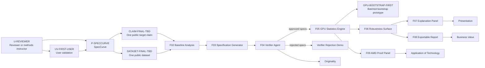

# Entity Graph

This page is a navigational graph for builders. It is not a decorative architecture diagram.

## Core Flow

## Navigational Edge Table

| From | Relationship | To | Why it matters |
|---|---|---|---|
| Product: SpecCurve | supports | User: reviewer/methods instructor | Keeps MVP anchored to a specific workflow. |
| User pain | depends_on | Manual robustness checks | Explains why report export matters. |
| Paper | uses | Dataset | Product requires existing public data. |
| Claim | depends_on | Paper and dataset | Claim cannot be invented or broadened. |
| Baseline analysis | verifies | Dataset/claim viability | Agents do not matter until baseline works. |
| Specification generator | produces | Candidate specifications | Agentic layer creates structured work, not prose. |
| Verifier agent | rejects | Invalid specifications | Main live proof that agents are useful. |
| Deterministic verifier rules | verify | Specification constraints | Hard checks beat LLM judgment. |
| GPU statistics engine | uses | Approved specs and tensors | AMD workload is tied to product output. |
| Benchmark | demonstrates | MI300X load-bearing value | Prevents decorative GPU usage. |
| User validation | verifies | First-user value | Prevents app polish before the report is useful. |
| Batched bootstrap prototype | demonstrates | First MI300X workload | Resolves the first-operation blocker from product-lens v2. |
| Robustness surface | demonstrates | Claim sensitivity/stability | Main presentation moment. |
| Explanation panel | mitigates | Overclaiming risk | Keeps conclusions cautious. |
| Decision log | supersedes | Older BinderForge/replication framing | Prevents drift back to unsafe language. |

## Judging Connections

| Judging criterion | Primary graph evidence | Required artifact |
|---|---|---|
| Application of Technology | GPUWorkload -> Benchmark -> AMD proof panel | Benchmark JSON/log and UI panel |
| Presentation | DemoMoment -> robustness surface -> cautious conclusion | Two-minute demo script/video |
| Business Value | User -> pain -> exportable report | Report export artifact |
| Originality | Agent -> verifier rejection -> provenance | Approved/rejected spec log |

## Open Nodes

These nodes must remain `uncertain` until selected and logged:

- `DATASET-FINAL-TBD`
- `PAPER-FINAL-TBD`
- `CLAIM-FINAL-TBD`
- `HOSTING-FINAL-TBD`
- `MODEL-ENDPOINT-FINAL-TBD`
